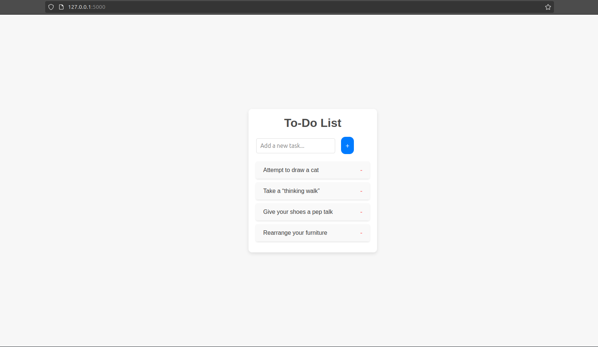

# Flask To-Do List

This is a simple To-Do List web application built using Flask. It allows users to add tasks, view them in a list, and delete tasks when done.
Features

  1) Add a task: Users can enter a new task in the input field and click the "Add" button to add it to the list.
  2) Delete a task: Each task has a "Delete" button to remove it from the list.
  3) Simple and responsive UI: The app uses minimal styling with CSS to provide a user-friendly experience.

### Requirements

To run this project locally, you'll need the following:

  Python 3.x
  Flask

### Installation

Clone the repository to your local machine:
```
git clone https://github.com/x0byte/flask_simple_todo_list.git
```

Navigate into the project directory:
```
cd flask_simple_todo_list
```

Run the Flask development server:
```
python app.py
```
By default, the application will run at http://127.0.0.1:5000/ in your browser.

### This is what it looks like:



